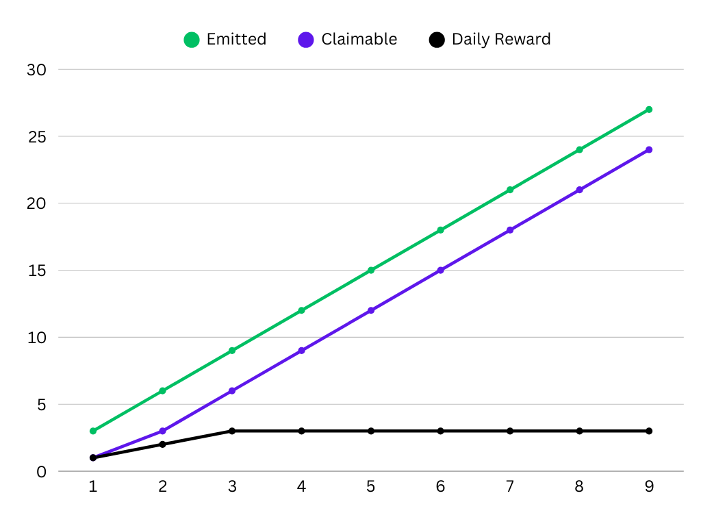

# Block Production and Emissions

Proof-of-Liquidity governs block rewards and token emissions on Berachain using the `$BGT` token. This page explains the mathematical principles behind validator selection, block rewards, and emissions calculations.

## Validator Selection

The network maintains an active set of **{{ config.mainnet.validatorActiveSetSize }} validators** who are eligible for block production. Selection criteria include:

- Only top **{{ config.mainnet.validatorActiveSetSize }} validators** by `$BERA` stake are included in active set
- Block proposal probability is proportional to staked `$BERA` and does not affect reward amounts
- Stake limitations per validator:
  - Minimum: {{ config.mainnet.minEffectiveBalance }} `$BERA`
  - Maximum: {{ config.mainnet.maxEffectiveBalance }} `$BERA`

## $BGT Emissions Structure

When a validator produces a block, `$BGT` tokens are emitted through two emission components:

1. Base Emission

   - **Fixed amount** equal to a `base rate` parameter (B)
   - Paid directly to block-producing validator

2. Reward Vault Emission

   - **Variable amount** dependent on validator's boost (x)
     - i.e. percentage of total `$BGT` delegated to the validator
   - Distributed to [Reward Vaults](/learn/pol/rewardvaults) selected by validator
     - Proportional to weights configured in the validator's [Reward Allocation](/nodes/guides/reward-allocation)
     - Validators receive [Incentives](/learn/pol/incentives) from projects based on amounts directed to their Reward Vaults

## Validator Boosts

Boost is a crucial metric that determines a validator's reward emissions:

- Calculated as the percentage of `$BGT` delegation a validator has compared to the total `$BGT` delegated in the network
- Expressed as a decimal between 0 and 1
- Example: If a validator has 1000 `$BGT` delegated and the network has 10000 total `$BGT` delegated, their boost would be 0.1 (10%)
  Higher boost leads to higher reward emissions, subject to the emission formula

## $BGT Emissions Per Block

The total `$BGT` emitted per block is calculated using the following formula:

$$emission = \left[B + \max\left(m, (a + 1)\left(1 - \frac{1}{1 + ax^b}\right)R\right)\right]$$

### Parameters

| Parameter                       | Description                                                    | Impact                                         |
| ------------------------------- | -------------------------------------------------------------- | ---------------------------------------------- |
| x (boost)                       | Fraction of total `$BGT` delegated to validator (range: [0,1]) | Determines `$BGT` emissions to Reward Vaults   |
| B (base rate)                   | Fixed amount of 0.5 `$BGT` for block production                | Determines baseline validator rewards          |
| R (reward rate)                 | Base `$BGT` amount for reward vaults                           | Sets foundation for reward emissions           |
| a (boost multiplier)            | Boost impact coefficient                                       | Higher values increase boost importance        |
| b (convexity parameter)         | Boost impact curve steepness                                   | Higher values penalize low boost more severely |
| m (minimum boosted reward rate) | Floor for reward vault emissions                               | Higher values benefit low-boost validators     |

### Sample Emissions Chart

Using the following sample parameters, we can visualize how emissions scale with `$BGT` delegation:
$$B = 0.5, R = 1.5, a = 3.5, b = 0.4, m = 0$$

## Max Block Inflation

`$BGT` emissions grow with the amount of boost a validator has, up to a cap. The maximum theoretical block emission occurs at 100% boost:

$$\max \mathbb{E}[\text{emission}] = \left[B + \max(m, aR)\right]$$

## `$BGT` Distribution

`$BGT` is emitted to reward vaults on a per-block basis via the [Distributor](../../developers/contracts/distributor.md#distributefor) by invoking the `distributeFor` function.
This invocation creates `$BGT` that is then claimable by [Reward Vault](../pol/rewardvaults.md) stakers.

:::tip
Rewards are created on a per-block basis; however, the distribution of rewards is done **over a three-day period.**
:::

Rewards are streamed linearly over this period to depositors proportionally to their deposit amounts.
The reward window is reset each time new rewards are added.

### Distribution Example

On Berachain, `$BGT` is distributed per block, meaning that the three-day distribution period is consistently being pushed to "start" on the current block. Thus, this period should be viewed as a sliding window based on the emissions at any given time during the previous three days.

A more real-world example with simplified numbers can be used to understand distribution currently (taking place over 9 days):

- 3 `$BGT` distributed daily, for a total of 27 over 9 days
- 1 depositor, owning all the deposits

The distribution graph would be as follows:

**Legend**

- Emitted: Total number of `$BGT` distributed and available
- Claimable: Total number of `$BGT` able to be claimed by depositors
- Daily Reward: Daily number of `$BGT` marked as claimable based on emitted tokens unlocks

This results in the depositor receiving an increasing amount of `$BGT` daily until rewards reach a saturation point after three days where all rewards are actively being distributed.
Given that rewards are distributed on a frequent basis, the reward rate on a new reward vault should normalize after the initial three-day period.

Reward duration periods incentivize ecosystem alignment with depositors via this distribution mechanism rather than allowing rewards to be instantly claimed.
